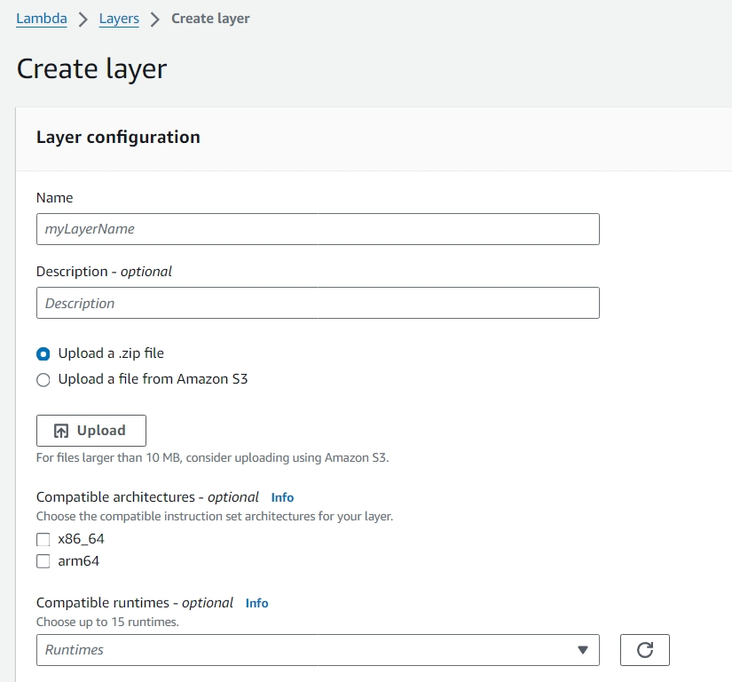

# Creating a Lambda layer

Creating a layer for you lambda function is super easy. Here I am demonstarting how to create a lambda layer for python runtime environemnt.

# Steps

1. Create a project folder locally.
2. Create a requirements.txt file and writedown all the libraries that your require( requests is the library we will be using in this example).
3. Create a virtual enviroment or globally install the libraries. (Creating a virtual environment is better)
4. Type in the command to create the file strutcture for you libraries. Just run this command `mkdir python/lib/python3.x/site-packages` replace x with the python version you will be using.
5. Then run the command `pip install -r requirements.txt --target  python/lib/python3.x/site-packages`
6. Now we have to zip the python folder, for this you can run this command in the powershell `Compress-Archive -Path ./python -DestinationPath ./layer_contents.zip`.
7. Now move to the AWS Management Console, go to the AWS Lambda Service and Create a layer.

 

8. Give a name to your layer and in the runtime select the python runtime environment you will be using.
9. Now go the lambda function were you itend to use the layer.
10. Scroll to bottom to the layer section and add the layer you have just created to your lambda function.
